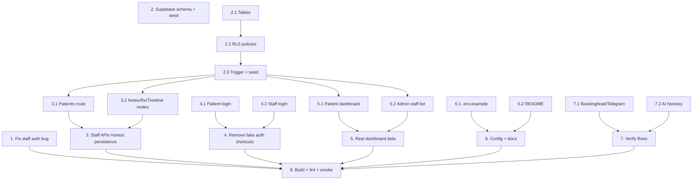

# Implementation Plan — HOMMED Production Readiness

## Overview

This plan makes the HOMMED clinic app production ready: it fixes the critical staff-portal
authentication bug, ships a reproducible Supabase schema + seed, removes fake-auth and silent
demo-fallback behaviors so the app fails honestly, replaces hardcoded dashboard metrics with
real data, corrects/documents configuration, and verifies the booking, lead, notification, and
AI flows. Tasks are ordered risk-first and map back to the requirements and design documents in
this directory.

## Tasks

- [-] 1. Fix critical staff portal authentication bug
  - In `app/staff/page.tsx`, rewrite the collapsed `fetchWithAuth` helper so it interpolates
    the real token into the `Authorization` header (`Bearer ${token}`) and preserves any
    existing headers instead of sending an empty `Bearer `.
  - Verify all staff data calls (patients, prescriptions, notes, timeline, appointments) use
    this helper and now send the token.
  - _Requirements: 1.1, 1.2, 1.3_

- [x] 2. Create the Supabase database schema and seed file
  - [x] 2.1 Author `supabase/schema.sql` with all tables
    - Create `profiles`, `appointments`, `leads`, `services`, `blogs`, `popups`, `patients`,
      `patient_notes`, `prescriptions`, `patient_timeline` with snake_case columns matching the
      API route handlers exactly (see design Data Models).
    - Make the script idempotent (`create table if not exists`, `create or replace function`).
    - _Requirements: 5.1, 5.2_
  - [x] 2.2 Add Row Level Security policies
    - Public `select` for `services`, `blogs`, `popups`; public `insert` for `leads`,
      `appointments`; deny anon access to clinical tables (`patients`, `patient_notes`,
      `prescriptions`, `patient_timeline`); own-row access for `profiles`.
    - _Requirements: 5.3, 3.3_
  - [x] 2.3 Add new-user profile trigger and seed data
    - Add `handle_new_user()` function + trigger on `auth.users` to insert a `profiles` row
      (role `patient`, `admin@hommed.com` → `admin`).
    - Seed the 8 services, 3 blogs, and 4 popups from `lib/data.ts`.
    - _Requirements: 5.4, 6.4_

- [x] 3. Make staff clinical APIs persist real data (no fabricated success)
  - [x] 3.1 Patients route honesty + auth
    - In `app/api/staff/patients/route.ts`, return real errors (`500`/`400`) on DB failure
      instead of `getSimulatedPatients()` / `mock-uuid-*`; return `[]` when empty; add
      `verifyStaffToken` gate and `id` validation to the `PUT` handler; remove the simulated
      helper.
    - _Requirements: 3.1, 3.2, 3.3, 3.4_
  - [x] 3.2 Notes, prescriptions, timeline route honesty
    - In `app/api/staff/{notes,prescriptions,timeline}/route.ts`, remove `getSimulated*`
      fallbacks and `mock-*` insert responses; return real status codes on error and `[]`
      when empty; keep `verifyStaffToken` on every method.
    - _Requirements: 3.1, 3.2, 3.4_

- [x] 4. Remove fake authentication shortcuts
  - [x] 4.1 Patient login cleanup
    - In `app/login/page.tsx`, remove `handleGoogleMock` and the "Continue with Google" button
      and its `or` separator; make "Forgot password?" a real action (reset email handler or a
      WhatsApp/mailto contact link) instead of a dead control; remove now-unused imports.
    - _Requirements: 2.1, 2.3, 9.2_
  - [x] 4.2 Staff login cleanup
    - In `app/login/staff/page.tsx`, remove `handleStaffMock`, the "Demo Testing" separator,
      and the "Use Simulated Staff Account (Offline Demo Mode)" button; remove unused imports.
    - _Requirements: 2.2, 2.3_

- [x] 5. Replace mock data in dashboards with real values
  - [x] 5.1 Patient dashboard real metrics
    - In `app/dashboard/page.tsx`, remove the `+3` consultation offset and any inflated
      counts; remove the fabricated "88% Immune Wellness" stat card; replace `mockMedicalLogs`
      usage with real prescription data for the authenticated patient or a clear empty state.
    - _Requirements: 4.1, 4.2, 4.3_
  - [x] 5.2 Admin staff list from real source
    - Add an admin-only `GET /api/admin/staff` returning `profiles` where `role = 'staff'`;
      load the Staff Accounts tab in `app/admin/page.tsx` from it instead of the hardcoded
      array; remove the inflated `prescriptions.length + 4` in `app/staff/page.tsx` overview.
    - _Requirements: 4.4, 4.1_

- [x] 6. Correct configuration and add documentation
  - [x] 6.1 Fix `.env.example`
    - Rewrite to list only Supabase (required) and Telegram (optional) variables; remove
      MongoDB, JWT, NEXTAUTH, and Cloudinary entries.
    - _Requirements: 6.1, 6.2_
  - [x] 6.2 Add README with setup + ops notes
    - Document required/optional env vars, how to run `supabase/schema.sql`, admin account
      bootstrap, the localStorage-token security caveat, the recommendation to rotate the
      committed service-role key, and the AI assistant being a guided (non-diagnostic) helper.
    - _Requirements: 6.2, 6.3, 6.4, 8.1_

- [x] 7. Verify booking, lead, notification, and AI flows
  - [x] 7.1 Confirm booking/lead/Telegram paths are non-blocking and correct
    - Verify `app/api/appointments/route.ts` creates appointment + auto-lead + best-effort
      Telegram and that notification failures never block the 201; confirm the double-booking
      guard; confirm `app/api/leads/route.ts` persists and notifies.
    - _Requirements: 7.1, 7.2, 7.3, 7.4, 7.5_
  - [x] 7.2 AI assistant honesty pass
    - In `components/AIAssistant.tsx`, adjust labels to present a guided wellness/info
      assistant (not a diagnostic medical AI); confirm lead capture writes to `/api/leads`
      and no persisted-action claim is made on failure.
    - _Requirements: 8.1, 8.2, 8.3_

- [ ] 8. Final build, lint, and smoke verification
  - Run `npm run build` (must exit 0) and `npm run lint` (no blocking errors); fix any unused
    imports left by removals; confirm referenced assets resolve.
  - Walk the documented manual smoke checklist (public lead/booking, admin reads, staff
    create→reload persistence, double-book rejection, removed demo buttons).
  - _Requirements: 9.1, 9.2, 9.3, 9.4_

## Task Dependency Graph



```json
{
  "waves": [
    {
      "wave": 1,
      "tasks": ["1", "2.1", "4.1", "4.2", "6.1", "7.1", "7.2"]
    },
    {
      "wave": 2,
      "tasks": ["2.2"]
    },
    {
      "wave": 3,
      "tasks": ["2.3"]
    },
    {
      "wave": 4,
      "tasks": ["3.1", "3.2", "5.1", "5.2", "6.2"]
    },
    {
      "wave": 5,
      "tasks": ["8"]
    }
  ]
}
```

## Notes

- Ordering is risk-first: Task 1 (the critical staff-auth fix) is independent and ships first.
- Task 2 (schema) is a prerequisite for the honest-data behavior in Tasks 3 and 5 to surface
  real rows; the SQL file is applied manually in the Supabase SQL editor by the operator.
- Where real data cannot be safely completed under the delivery window, the plan chooses an
  honest empty/labeled state over mock data (per design decision in C4).
- Out of scope (documented, not silently dropped): full Google OAuth, httpOnly-cookie auth,
  LLM-backed AI, automated test suite, rotating the committed service-role key.
